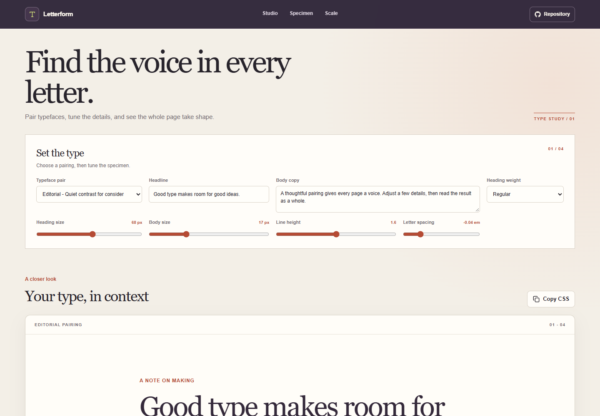

# Typography Specimen Gallery

Letterform is a small typography studio for comparing local system font pairings, tuning text details, and seeing those choices in a sample page. It is intended for designers and developers who want to test a typographic direction before applying it to a project.

**Live site:** [https://a2rp.github.io/typography-specimen-gallery/](https://a2rp.github.io/typography-specimen-gallery/)

## What is included

- A fixed, responsive header with links to the studio, specimen, and type scale, plus a link to the source repository.
- Four system font pairings: Editorial, Humanist, Workshop, and Classic. The gallery uses fonts already available on the visitor's device, so it does not download web fonts.
- Text fields for a sample headline and paragraph, a heading weight selector, and sliders for heading size, body size, line height, and letter spacing.
- A live sample page that applies the selected pairing and controls as they change. Use **Copy CSS** to copy the current heading and body declarations.
- A type scale that follows the selected body size. Choose a Minor third, Major third, or Perfect fourth ratio to see eight related text sizes, then use **Copy scale CSS** to copy the values as CSS custom properties.
- A footer with project source, profile, and support links, and a floating **Back to top** button after scrolling down the page.

## How it works

Choose a pairing in the studio, then edit the headline and paragraph or adjust the selectors and sliders. The specimen updates immediately. The type scale uses the current body size as its base and calculates the surrounding steps from the selected ratio. The copied CSS reflects the settings currently visible in the studio.

Settings are held in React state in the current page only. They are not saved to local storage or sent to a server, and returning to the page or refreshing it restores the example settings. Clipboard buttons require browser clipboard access, which is available on the deployed HTTPS site and on supported local development origins.

## Run locally

Use Node.js and npm, then run these commands from this directory:

```sh
npm install
npm run dev
```

## Checks and deployment

```sh
npm run lint
npm run build
npm run deploy
```

The deploy command builds the app and publishes `dist` to the `gh-pages` branch. The project uses Vite's `/typography-specimen-gallery/` base path for GitHub Pages.

## Future improvements

These are ideas and are not implemented yet:

- Add optional hosted font sources with clear licensing details.
- Save and restore named pairing presets in local storage.
- Export a complete set of CSS variables and responsive type rules.
- Add more specimen layouts for editorial pages, product interfaces, and mobile screens.

## Links

- Portfolio: [https://www.ashishranjan.net](https://www.ashishranjan.net)
- GitHub: [https://github.com/a2rp](https://github.com/a2rp)
- CodePen: [https://codepen.io/ash1198](https://codepen.io/ash1198)
- LinkedIn: [https://www.linkedin.com/in/aashishranjan](https://www.linkedin.com/in/aashishranjan)
- Facebook: [https://www.facebook.com/theash.ashish/](https://www.facebook.com/theash.ashish/)
- YouTube: [https://www.youtube.com/@ashishranjan-ashz?sub_confirmation=1](https://www.youtube.com/@ashishranjan-ashz?sub_confirmation=1)
- Email: [mailto:ash.ranjan09@gmail.com](mailto:ash.ranjan09@gmail.com)

## Support

- Support: [https://a2rp-donation-page.netlify.app/](https://a2rp-donation-page.netlify.app/)
- Buy Me a Coffee: [https://buymeacoffee.com/ashishranjan](https://buymeacoffee.com/ashishranjan)
- Patreon: [https://www.patreon.com/ashishranjan](https://www.patreon.com/ashishranjan)
